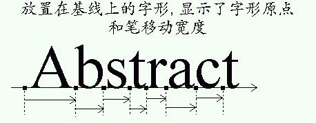

### III. 字形度量

#### 1. 基线, 笔与布局

基线是一条用于在渲染文本时引导字形的想象的线. 它既可以是水平方向的（如拉丁语, 西里尔文字, 阿拉伯语中）, 也可以是垂直的（如中文, 日语, 蒙古语中). 此外, 通过一个位于基线上的虚拟点定位字形, 这个虚拟的点被称为*笔位置*或*原点*

不同的布局使用的字形定位约定有所不同:

- 对于水平布局, 字形直接“躺”在基线上. 通过向左或向右增加(移动)笔位置完成文本的渲染.

  相邻的两个笔位置之间的距离取决于具体字形, 被称为*光标移动宽度(advance width)*. 值得注意的是, 这个值*总是*正值, 即使在阿拉伯文字之类的由右向左书写/阅读的文字来说也是如此. 这与文本的渲染方式有所不同.

  *笔位置总是位于基线上.*
  
         

- 对于垂直布局, 字形以基线为中心排布:

                

#### 2. 字体排印度量与定界框

一个字体会为其中的所有字形定义一定数量的外观度量.

- 上坡度(ascent)

  从基线到用来放置轮廓点的最高网格坐标的距离. 由于网格坐标系的Y轴以向上为正方向, 这会是一个正值.

- 下坡度(descent)

  从基线到用来放置轮廓点的最低网格坐标的距离. 由于网格坐标系的方向, 在FreeType中该值被定义为负值. 但应该注意在某些字体格式中这个值仍然是正值.

- 行距(linegap)

  相邻两行文本之间的最小距离. 使用字体排印相关的数值, 基线与基线之间的距离可以通过`基线间距离 = 上坡度 - 下坡度 + 行距`.

除此之外, 还有这些简单些的度量:

- 定界框(bounding box)

  定界框是一个能包围字体中的字形的假想边框, 且通常特指这样的边框中尽可能紧密的一个. 定界框由可以针对任何轮廓计算的四个参数, `xMin`, `yMin`, `xMax`, `yMax`表示. 若依据原始轮廓测量, 则它们的值可以以字体单位为单位; 若是在经过缩放的轮廓上, 也可以以整数（或分数）像素为单位.

  通常也将定界框简称为“bbox”.

- Internal leading

  这个概念直接从传统的字体排印而来. It represents the amount of space within the *leading* which is reserved for glyph features that lay outside of the EM square (like accentuation). 	It usually can be computed as

  ​		`internal leading = ascent - descent - EM_size`              

- External leading

  This is another name for the line gap.

#### 3. Bearings and Advances

Each glyph has also distances called *bearings* and     *advances*.  The actual values depend on the     layout, as the same glyph can be used to render text     either horizontally or vertically:

- Left side bearing

  The horizontal distance from the current pen position 	to the glyph's left bbox edge.  It is positive for 	horizontal layouts, and in most cases negative for 	vertical ones.

  In the FreeType API, this is also called 	`bearingX`.  Another shorthand is 	‘lsb’.

- Top side bearing

  The vertical distance from the baseline to the top of 	the glyph's bbox.  It is usually positive for 	horizontal layouts, and negative for vertical 	ones.

  In the FreeType API, this is also called 	`bearingY`.

- Advance width

  The horizontal distance to increment (for 	left-to-right writing) or decrement (for right-to-left 	writing) the pen position after a glyph has been 	rendered when processing text.  It is always positive 	for horizontal layouts, and zero for vertical 	ones.

  In the FreeType API, this is also called 	`advanceX`.

- Advance height

  The vertical distance to decrement the pen position 	after a glyph has been rendered.  It is always zero 	for horizontal layouts, and positive for vertical 	layouts.

  In the FreeType API, this is also called 	`advanceY`.

- Glyph width

  The glyph's horizontal extent.  For unscaled font 	coordinates, it is

  ​		`glyph width = bbox.xMax - bbox.xMin`       

  For scaled glyphs, its computation requests specific 	care, described in the grid-fitting chapter below.

- Glyph height

  The glyph's vertical extent. For unscaled font 	coordinates, it is

  ​		`glyph height = bbox.yMax - bbox.yMin`       

  For scaled glyphs, its computation requests specific 	care, described in the grid-fitting chapter below.

- Right side bearing

  Only used for horizontal layouts to describe the 	distance from the bbox's right edge to the advance 	width.  In most cases it is a non-negative number:

  ​		`right side bearing = advance_width - 	  left_side_bearing - (xMax-xMin)`              

  A common shorthand for this value is 	‘rsb’.

Here is a picture giving all the details for horizontal metrics: 	  

​	       

And here is another one for the vertical metrics:

​	       

#### 4. The effects of grid-fitting

Because hinting aligns the glyph's control points to the     pixel grid, this process slightly modifies the dimensions     of character images in ways that differ from simple     scaling.

For example, the image of the lowercase ‘m’     letter sometimes fits a square in the master grid.     However, to make it readable at small pixel sizes, hinting     tends to enlarge its scaled outline horizontally in order     to keep its three legs distinctly visible, resulting in a     wider character bitmap.

The glyph metrics are also influenced by the grid-fitting     process:

- The image's width and height are altered.  Even if 	this is only by one pixel, it can make a big 	difference at small pixel sizes.
- The image's bounding box is modified, thus modifying 	the bearings.
- The advances must be updated.  For example, the 	advance width must be incremented if the hinted bitmap 	is larger than the scaled one, to reflect the 	augmented glyph width.

This has some implications:

- Because of hinting, simply scaling the font ascent or 	descent might not give correct results.  A possible 	solution is to keep the ceiling of the scaled ascent, 	and floor of the scaled descent.
- There is no easy way to get the hinted glyph and 	advance widths of a range of glyphs, as hinting works 	differently on each outline.  The only solution is to 	hint each glyph separately and record the returned 	values (for example in a cache).  Some formats, like 	TrueType, even include a table of pre-computed values 	for a small set of common character pixel sizes.
- Hinting depends on the final character width and 	height in pixels, which means that it is highly 	resolution-dependent.  This property makes correct 	WYSIWYG layouts difficult to implement.

Performing 2D transformations on glyph outlines is very     easy with FreeType.  However, when using translation on     hinted outlines, one should always take care     of **exclusively using integer pixel distances** (which     means that the parameters to the     `FT_Outline_Translate` API function should all     be multiples of 64, as the point coordinates are in     26.6 fixed-point format).  Otherwise, the translation     will simply *ruin the hinter's work*, resulting in     very low quality bitmaps!

Note, however, that the restriction to integer pixel            distances mentioned in the previous paragraph has become            weaker; today, it is quite common to do *no*            hinting along the horizontal axis, only adjusting the            glyphs vertically.  Typical examples are Microsoft's            ClearType implementation, FreeType's new CFF engine            (contributed by Adobe), or the ‘light’            auto-hinting mode.  For such modes you get best rendering            results if you do sub-pixel glyph positioning.

#### 5. Text widths and bounding box

As seen before, the ‘origin’ of a given glyph     corresponds to the position of the pen on the baseline.     It is not necessarily located on one of the glyph's     bounding box corners, unlike many typical bitmapped font     formats.  In some cases, the origin can be out of the     bounding box, in others, it can be within it, depending on     the shape of the given glyph.

Likewise, the glyph's ‘advance width’ is the     increment to apply to the pen position during layout, and     is not related to the glyph's ‘width’, which     really is the glyph's bounding box width.

The same conventions apply to strings of text, with the   following consequences.

- The bounding box of a given string of text doesn't 	necessarily contain the text cursor, nor is the latter 	located on one of its corners.
- The string's advance width isn't related to its 	bounding box dimensions.  Especially if it contains 	leading and trailing spaces or tabs.
- Finally, additional processing like kerning creates 	strings of text whose dimensions are not directly related to the simple juxtaposition of individual glyph metrics.  For example, the advance width of ‘VA’ isn't the sum of the advances of ‘V’ and ‘A’ taken separately.